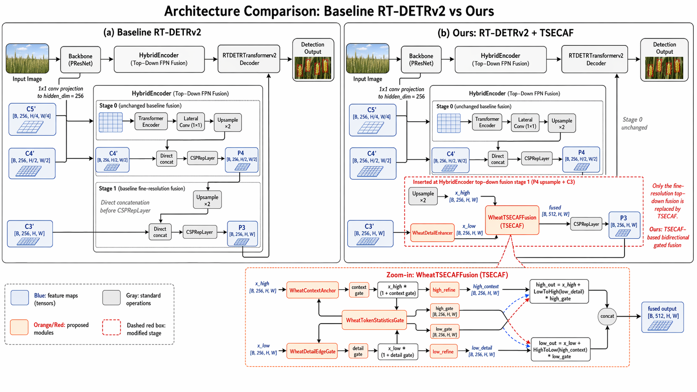
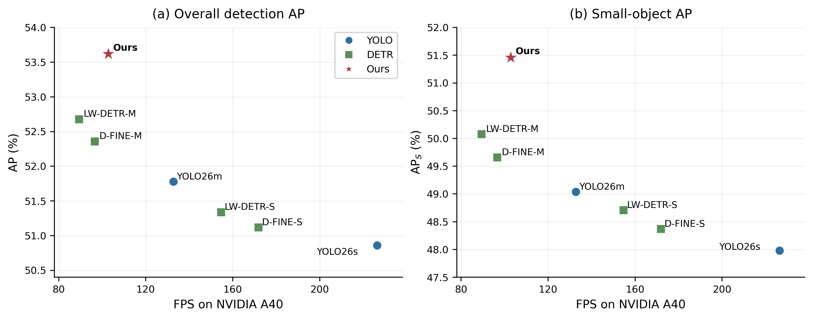
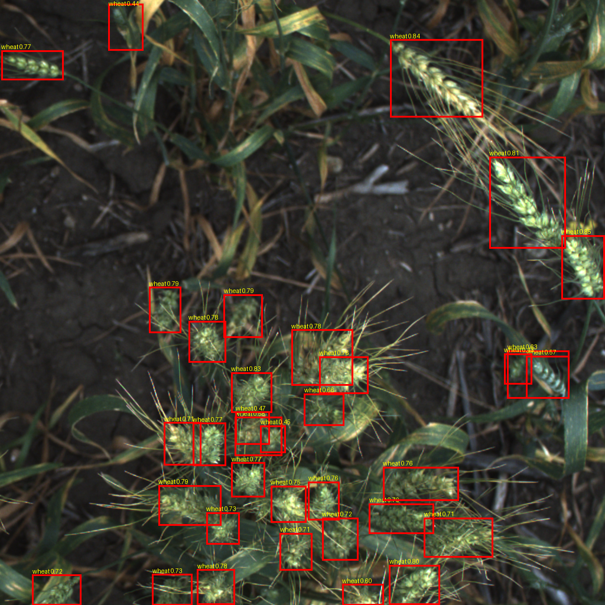
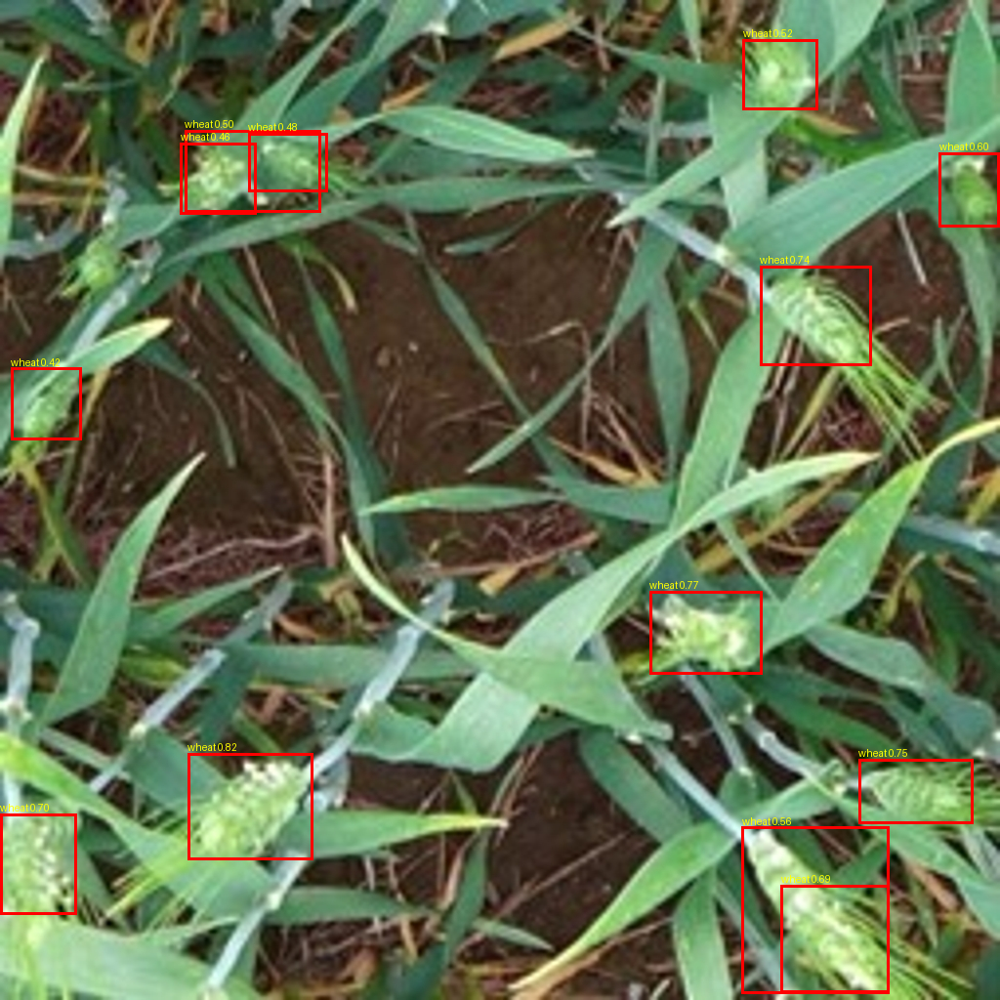
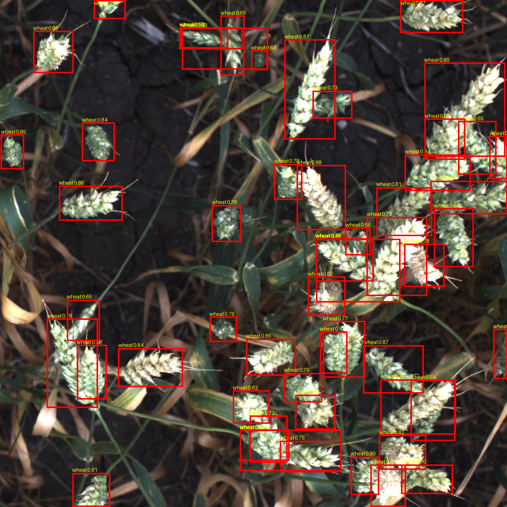
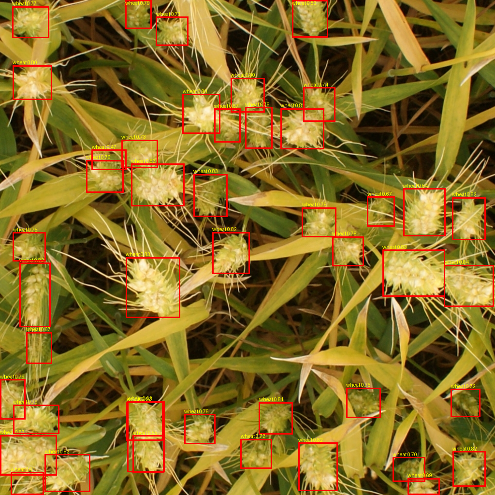

# TSECAF-DETR

PyTorch implementation of **TSECAF-DETR: Representation-Query Co-Design for Real-Time Dense Wheat Head Detection**.

TSECAF-DETR is built on RT-DETRv2 and targets dense wheat-head scenes where compact objects can be lost first during high-resolution evidence formation and then during proposal-to-query allocation. The method treats detection as a single **evidence-to-query allocation pathway**: Wheat-TS-ECAF coordinates semantic context and local detail before proposal generation, and compact-query allocation directs decoder queries toward the head-scale candidates exposed by that representation.

> Public commands below use the TSECAF-DETR preset names. Legacy preset and config aliases are retained for older experiment logs.

## Overview

<p align="center">
  
</p>

Pathway design:

- **Context-detail evidence formation**: token statistics guide semantic-detail exchange at the finest top-down fusion stage.
- **Detail-sensitive low-level evidence**: boundary responses are preserved before semantic information is exchanged across branches.
- **Compact-query allocation**: objectness is combined with an area-aware prior so decoder capacity follows head-scale candidates.
- **Real-time end-to-end inference**: the detector preserves the RT-DETRv2 decoding path without NMS.

## Main Results

Source-domain results on GWHD2021 at `1024 x 1024` input resolution:

| Model | AP | AP50 | AP75 | AP-S | FPS |
|---|---:|---:|---:|---:|---:|
| YOLO11m | 50.71 | 91.58 | 56.84 | 47.91 | 145.2 |
| RT-DETRv2-R50 | 50.68 | 91.74 | 56.92 | 47.96 | 108.5 |
| **TSECAF-DETR-R50** | **53.62** | **93.18** | **60.41** | **51.46** | 102.8 |

Cross-dataset transfer and image-level counting:

| Evaluation | RT-DETRv2-R50 | TSECAF-DETR-R50 | Change |
|---|---:|---:|---:|
| GWHD2021 AP | 50.68 | **53.62** | +2.94 |
| Wheat Ears AP | 40.36 | **44.55** | +4.19 |
| Global Wheat CodaLab AP | 56.09 | **58.70** | +2.61 |
| GWHD2021 counting MAE | 7.18 | **5.68** | -1.50 |

<p align="center">
  
</p>

Qualitative detections on dense GWHD2021 validation images:

|  |  |
|---|---|
|  |  |
|  |  |

## Repository Layout

```text
tsecaf_detr/
  configs/
    dataset/      # COCO-style wheat dataset configs
    rtdetrv2/     # baseline, TSECAF-DETR, transfer, and pathway-ablation configs
  src/
    zoo/rtdetr/   # RT-DETRv2 model and TSECAF-DETR evidence-to-query pathway
  tools/
    train_gwhd_a40.py
    test_gwhd_a40.py
    prepare_wheat_datasets.py
    visualize_gwhd_predictions.py
    run_profile.py
```

## Installation

```bash
cd tsecaf_detr
python -m pip install --upgrade pip
pip install -r requirements.txt
```

Install the `torch` and `torchvision` wheels that match your CUDA runtime before installing the remaining dependencies if needed.

The paper experiments were run on a single NVIDIA A40 GPU. Some environments may need cuDNN disabled for stable RT-DETRv2 training:

```bash
export RTDETR_DISABLE_CUDNN=1
```

## Datasets

Datasets are not included. Put COCO-style datasets under `tsecaf_detr/datasets` or set:

```bash
export WHEAT_DATASETS_ROOT=/path/to/datasets
```

Expected layout:

```text
datasets/
  gwhd_2021/
    train2017/
    val2017/
    annotations/instances_train2017.json
    annotations/instances_val2017.json
  Wheat_Ears_Detection_Dataset_rtdetr/
    train2017/
    val2017/
    annotations/instances_train2017.json
    annotations/instances_val2017.json
  global-wheat-codalab-official_rtdetr/
    train2017/
    val2017/
    annotations/instances_train2017.json
    annotations/instances_val2017.json
```

Dataset protocol:

- GWHD2021: source dataset, 5499 training images and 1016 validation images.
- Wheat Ears: XML annotations converted to COCO, fixed 80:20 split.
- Global Wheat CodaLab: labeled subsets only, fixed 80:20 split per subset.
- Transfer experiments use GWHD2021-trained checkpoints without target-domain fine-tuning.

Conversion helpers:

```bash
python tools/prepare_wheat_datasets.py --preset wheat_ears
python tools/prepare_wheat_datasets.py --preset global_wheat_codalab
```

## Training

Run commands from `tsecaf_detr/`.

Train the final TSECAF-DETR-R50 model:

```bash
python tools/train_gwhd_a40.py --preset tsecaf_detr_r50
```

Train paired RT-DETRv2 baselines:

```bash
python tools/train_gwhd_a40.py --preset baseline_r18
python tools/train_gwhd_a40.py --preset baseline_r34
python tools/train_gwhd_a40.py --preset baseline_r50
```

Train TSECAF-DETR model scales:

```bash
python tools/train_gwhd_a40.py --preset tsecaf_detr_r18
python tools/train_gwhd_a40.py --preset tsecaf_detr_r34
python tools/train_gwhd_a40.py --preset tsecaf_detr_r50
```

Outputs are written to `output/`, which is ignored by Git.

## Evaluation

GWHD2021 validation:

```bash
python tools/test_gwhd_a40.py --preset tsecaf_detr_r50
python tools/test_gwhd_a40.py --preset baseline_r50
```

Direct transfer without target-domain fine-tuning:

```bash
python tools/test_gwhd_a40.py --preset wheat_ears_tsecaf_detr_r50
python tools/test_gwhd_a40.py --preset global_wheat_codalab_tsecaf_detr_r50
python tools/test_gwhd_a40.py --preset wheat_ears_baseline_r50
python tools/test_gwhd_a40.py --preset global_wheat_codalab_baseline_r50
```

Profile parameters and FLOPs:

```bash
python tools/run_profile.py \
  -c configs/rtdetrv2/tsecaf_detr_r50vd_180e_gwhd.yml
```

Visualize predictions:

```bash
python tools/visualize_gwhd_predictions.py --preset tsecaf_detr_r50_val_best
```

## Paper-to-Code Map

| Paper item | Code location |
|---|---|
| Context-detail evidence formation | `src/zoo/rtdetr/hybrid_encoder.py` |
| Compact-query allocation | `src/zoo/rtdetr/rtdetrv2_decoder.py` |
| TSECAF-DETR configs | `configs/rtdetrv2/tsecaf_detr_*_gwhd.yml` |
| RT-DETRv2 baseline configs | `configs/rtdetrv2/rtdetrv2_*_gwhd_baseline.yml` |
| Cross-dataset transfer configs | `configs/rtdetrv2/*eval_wheat_ears*.yml`, `configs/rtdetrv2/*eval_global_wheat_codalab*.yml` |
| Training presets | `tools/train_gwhd_a40.py` |
| Evaluation presets | `tools/test_gwhd_a40.py` |

## Notes

- Public datasets and official RT-DETRv2 pretrained checkpoints must be downloaded separately.
- External baselines such as Faster R-CNN, RetinaNet, YOLO, D-FINE, and LW-DETR are not vendored in this reduced release.
- Generated checkpoints, logs, exported models, and visualization outputs are ignored by Git.
- For exact table reproduction, archive the trained checkpoints and per-seed evaluation outputs with the manuscript version.

## License

This code is released under the license in [LICENSE](LICENSE).

## Citation

If this repository is useful for your work, please cite the associated TSECAF-DETR paper after publication, together with RT-DETRv2 and the public wheat datasets used in your experiments.
